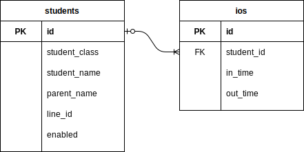

# 機能仕様

## 画面一覧

## ER図

## DBテーブル

### students

| PK/FK | Attribute | Type | Validation |
| --- | --- | --- | --- |
| PK | id | int | auto_increment |
|| student_class | string ||
|| student_name | string | required:true |
|| parent_name | string ||
|| line_id | string ||
|| enabled | boolean ||

## 画面遷移図

## 登録画面

### 初期値

### エラーチェック

### イベント

### その他仕様

## 検索画面

### 初期値

### エラーチェック

### イベント

### その他仕様

## 照会画面

### 初期値

### エラーチェック

### イベント

### その他仕様

## 更新画面

### 初期値

### エラーチェック

### イベント

### その他仕様